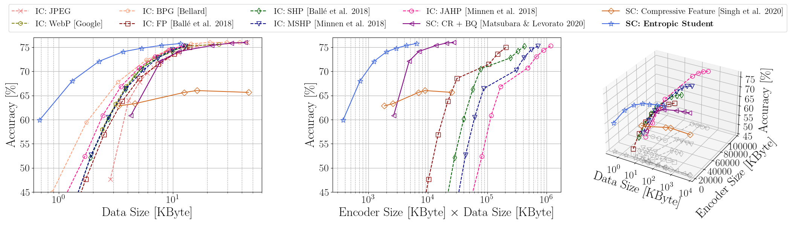
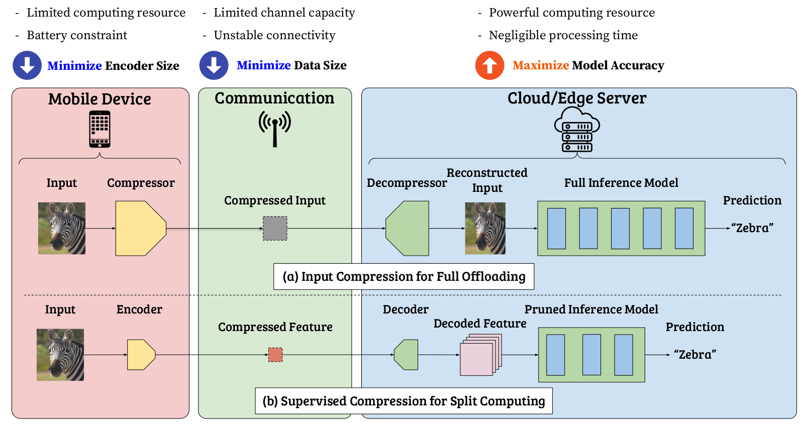

# SC2: Supervised Compression for Split Computing
[](https://badge.fury.io/py/sc2bench)
This is the official repository of `sc2bench` package and ["SC2: Supervised Compression for Split Computing"](#Citation).

As an intermediate option between local computing and edge computing (full offloading), ***split computing*** has been 
attracting considerable attention from the research communities.

In split computing, we split a neural network model into two sequences so that some elementary feature transformations
are applied by the first sequence of the model on a weak mobile (local) device. 
Then, intermediate, informative features are transmitted through a wireless communication channel to a powerful 
edge server that processes the bulk part of the computation (the second sequence of the model).  



ImageNet (ILSVRC 2012): R-D (rate-distortion), ExR-D, and three-way tradeoffs for input compression and supervised compression with ResNet-50 as a reference model



Input compression is an approach to save transmitted data, but it leads to transmitting information irrelevant to 
the supervised task.
To achieve better supervised rate-distortion tradeoff, we define ***supervised compression*** as 
learning compressed representations for supervised downstream tasks such as classification, detection, or segmentation.
Specifically for split computing, we term the problem setting **SC2** (*Supervised Compression for Split Computing*).  

Note that the training process can be done offline (i.e., on a single device without splitting), 
and it is different from "split learning".

## SC2 Metrics
### 1. Encoder Size (to be minimized)
Local processing cost should be minimized as local (mobile) devices usually have battery constraints and limited computing power.
As a simple proxy for the computing costs, we measure the number of encoder parameters and 
define the encoder size as the total number of bits to represent the parameters of the encoder.

### 2. Data Size (to be minimized)
We want to penalize large data being transferred from the mobile device to the edge server while the BPP does not 
penalize it when feeding higher resolution images to downstream models for achieving higher model accuracy.

### 3. Model Accuracy (to be maximized)
While minimizing the two metrics, we want to maximize model accuracy (minimize supervised distortion).
Example supervised distortions are accuracy, mean average precision (mAP), and mean intersection over union (mIoU) for 
image classification, object detection, and semantic segmentation, respectively.

## Installation
```shell
pip install sc2bench
```

### Virtual Environments
For pipenv users,
```shell
pipenv install --python 3.8
# or create your own pipenv environment
pipenv install sc2bench 
```

For conda users,
```shell
conda env create -f environment.yaml
# or create your own conda environment
conda activate sc2-benchmark
pip install sc2bench
```

## Datasets
See instructions [here](script#datasets)

## Checkpoints
You can download our checkpoints including trained model weights [here](https://drive.google.com/file/d/1geENsiJJw3TXl4hhMEwUc4PL7V-YCwko/view?usp=sharing).  
Unzip the downloaded zip file under `./`, then there will be `./resource/ckpt/`.

## Supervised Compression
1. CR + BQ: ["Neural Compression and Filtering for Edge-assisted Real-time Object Detection in Challenged Networks"](https://arxiv.org/abs/2007.15818)
2. End-to-End: ["End-to-end Learning of Compressible Features"](https://arxiv.org/abs/2007.11797) 
3. Entropic Student: ["Supervised Compression for Resource-Constrained Edge Computing Systems"](https://openaccess.thecvf.com/content/WACV2022/html/Matsubara_Supervised_Compression_for_Resource-Constrained_Edge_Computing_Systems_WACV_2022_paper.html)

[README.md](https://github.com/yoshitomo-matsubara/sc2-benchmark/tree/main/script/task) explains how to train/test implemented supervised compression methods.

## Baselines: Input Compression
- [Codec-based input compression](https://github.com/yoshitomo-matsubara/sc2-benchmark/tree/main/script/codec_input_compression): JPEG, WebP, BPG
- [Neural input compression](https://github.com/yoshitomo-matsubara/sc2-benchmark/tree/main/script/neural_input_compression): Factorized Prior, Scale Hyperprior, Mean-scale Hyperprior, and Joint Autoregressive Hierarchical Prior

Each **README.md** gives instructions to run the baseline experiments.

## Codec-based Feature Compression
```shell
# JPEG
python script/task/image_classification.py -test_only --config configs/ilsvrc2012/feature_compression/jpeg-resnet50.yaml
# WebP
python script/task/image_classification.py -test_only --config configs/ilsvrc2012/feature_compression/webp-resnet50.yaml
```

## Citation
[[Preprint](https://arxiv.org/abs/2203.08875)]
```bibtex
@article{matsubara2022sc2,
  title={SC2: Supervised Compression for Split Computing},
  author={Matsubara, Yoshitomo and Yang, Ruihan and Levorato, Marco and Mandt, Stephan},
  journal={arXiv preprint arXiv:2203.08875},
  year={2022}
}
```

## Note
For measuring data size per sample precisely, it is important to keep test batch size of 1 when testing.  
E.g., some baseline modules may expect larger batch size if you have multiple GPUs.  
Then, add `CUDA_VISIBLE_DEVICES=0` before your execution command (e.g., `sh`, `bash`, `python`) 
so that you can force the script to use one GPU (use GPU: 0 in this case).

For instance, an input compression experiment using factorized prior (pretrained input compression model) 
and ResNet-50 (pretrained classifier)
```shell
CUDA_VISIBLE_DEVICES=0 sh script/neural_input_compression/ilsvrc2012-image_classification.sh factorized_prior-resnet50 8
```

## Issues / Questions / Requests
The documentation is work-in-progress. In the meantime, feel free to create an issue if you find a bug.  
If you have either a question or feature request, start a new discussion [here](https://github.com/yoshitomo-matsubara/sc2-benchmark/discussions).

## References
- [PyTorch (torchvision)](https://github.com/pytorch/vision)
- [PyTorch Image Models (timm)](https://github.com/rwightman/pytorch-image-models)
- [CompressAI](https://github.com/InterDigitalInc/CompressAI)
- [torchdistill](https://github.com/yoshitomo-matsubara/torchdistill) 
- Johannes Ballé, David Minnen, Saurabh Singh, Sung Jin Hwang and Nick Johnston. ["Variational image compression with a scale hyperprior"](https://openreview.net/forum?id=rkcQFMZRb) (ICLR 2018)
- David Minnen, Johannes Ballé and George D. Toderici. ["Joint Autoregressive and Hierarchical Priors for Learned Image Compression"](https://proceedings.neurips.cc/paper/2018/hash/53edebc543333dfbf7c5933af792c9c4-Abstract.html) (NeurIPS 2018)
- Yoshitomo Matsubara and Marco Levorato. ["Neural Compression and Filtering for Edge-assisted Real-time Object Detection in Challenged Networks"](https://arxiv.org/abs/2007.15818) (ICPR 2020)
- Saurabh Singh, Sami Abu-El-Haija, Nick Johnston, Johannes Ballé, Abhinav Shrivastava and George Toderici. ["End-to-end Learning of Compressible Features"](https://arxiv.org/abs/2007.11797) (ICIP 2020) 
- Yoshitomo Matsubara, Ruihan Yang, Marco Levorato and Stephan Mandt. ["Supervised Compression for Resource-Constrained Edge Computing Systems"](https://openaccess.thecvf.com/content/WACV2022/html/Matsubara_Supervised_Compression_for_Resource-Constrained_Edge_Computing_Systems_WACV_2022_paper.html) (WACV 2022)
